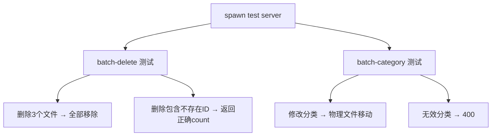

# Issue 1.4: 测试批量管理功能

## 目标

为文件批量管理功能编写端到端测试，覆盖后端 API 和前端 UI

## 测试模块

### 1. 后端 API 测试 (`test/file-batch.test.cjs`)

参考 `test/faq-batch.test.cjs`，使用 supertest 或 spawn 临时 server：

- 临时数据库 + 知识库目录（`/tmp/kb-test-xxx`）
- 上传测试文件 → 执行批量操作 → 验证文件系统和 DB

### 2. 前端 UI 测试 (`test/file-batch-ui.test.mjs`)

Playwright 测试，参考 `test/faq-batch-ui.test.mjs`：

- admin 登录 → checkbox 可见
- user 登录 → checkbox 不可见
- 勾选 2 个 → 计数更新
- 全选 → 所有勾选
- 批量删除 → 确认 → 文件减少
- 批量分类 → 分类更新

### 3. 回归测试

`kb-full-verify.mjs` 追加批量操作测试用例

## 验收标准

1. 后端测试：4-5 项测试全部通过
2. 前端测试：6-7 项测试全部通过
3. 现有回归测试不中断
